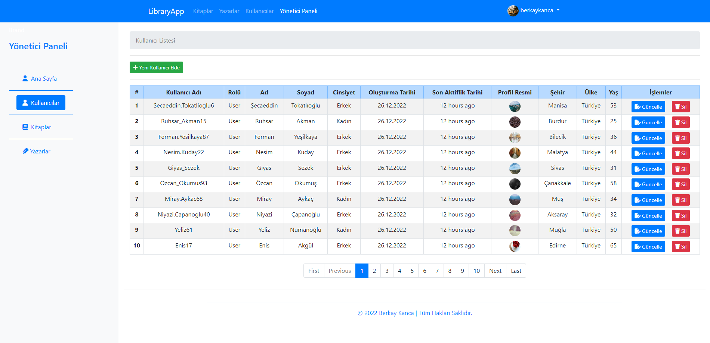

# Library App

[]

<h1 align="center">Library Tracking Project</h1>

<h2 align="center"> Web Application </h2>

<h4 align="center"> ~ Using Angular, N-Tier Architecture, .NET Core 6.0 Web API, Fluent Validation, JWT, Bogus, Identity, AutoMapper, Seed Data, Bootstrap ~ </h4>

## Packages Versions

- .NET Core : 6.0
- Angular : 11.2.5
- Bootstrap : 5.2.0

